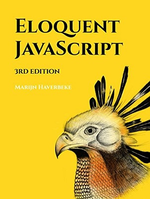
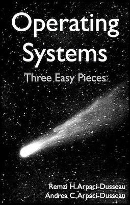
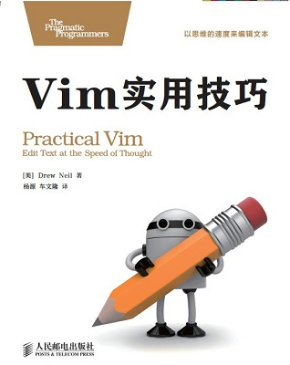
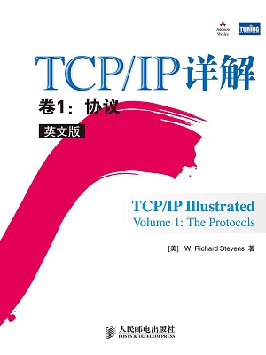
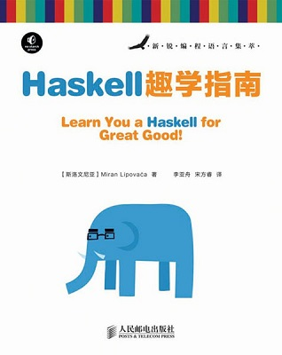
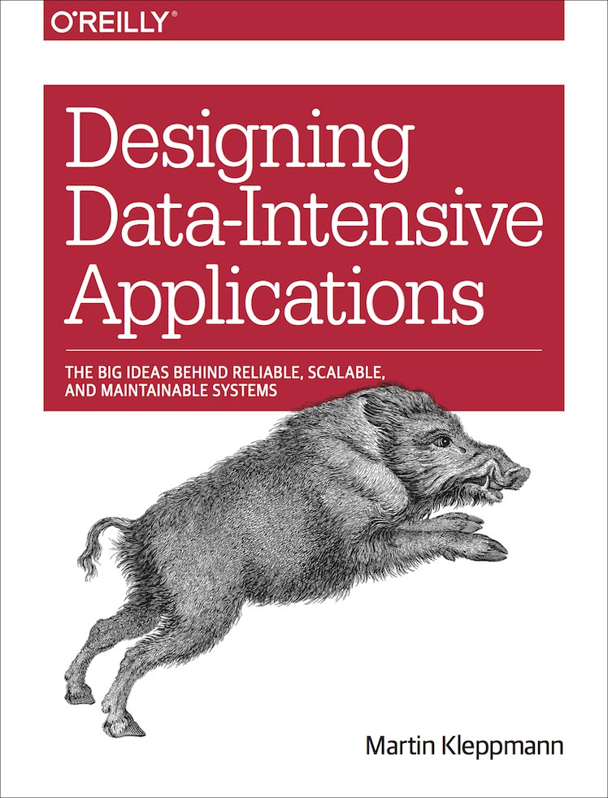

喜欢的工具🛠：

编辑器/IDE📝:

- Vim
- Emacs
- Vscode
- Sublime Text

字体👀：

- Victor Mono
- Jetbrains Mono
- Cascadia Code
- Hack

喜欢的📕：

- [Eloquent Javascript](https://book.douban.com/subject/30275136/)

- [Operating System: Three Easy Pieces](https://book.douban.com/subject/19973015/)

- [Vim实用技巧](https://book.douban.com/subject/25869486/)

- [TCP/IP Illustrated v1](https://book.douban.com/subject/4707725/) 

- [Haskell趣学指南](https://book.douban.com/subject/25803388/)

- [Designing Data Intensive Application](https://book.douban.com/subject/26197294/)

